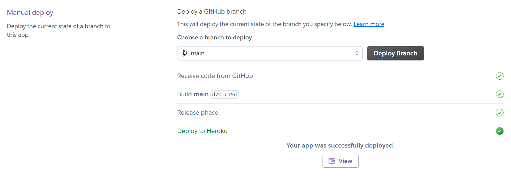

# Examining and Predicting the Consumer Price Index (CPI)

In this project we scrape, explore and use the [CPI](https://www.investopedia.com/terms/c/consumerpriceindex.asp) data acquired from the United States [Beuraue of Labor Statistics](https://www.bls.gov/cpi/) to predict the future CPI. We acquire the data using the API, in json format, convert that to a pandas dataframe and perform analysis on it. After the EDA, we de-trend the data and use ARIMA, GARCH and Facebook Prophet.

## Motivation
Having knowledge of the shift in the Consumer Price Index - which is a main indicator for price inflation, is very important for all businesses and financial institutions. A lot of time and effort is spent on trying to predict the direction of the CPI change for the future months. As a result, having an indication of the change in the CPI for the future months is motivated.

# Using the Project
## To run the webapp
Simply click [here](https://cpi-prediction.herokuapp.com/). The app automatically refreshes data when the new monthly CPI rate becomes available. You can choose whether to perform ARIMA-GARCH prediction or Facebook Prophet. The app is currently up on Heroku cloud and will refresh itself with the new monthly data whenever they are released. 

## To modify the code and make your own webapp
Clone the repository, you need the setup.sh, requirements.txt (note the version numbers), and the Procfile. 
The notebook contains extra information/plots regarding ARIMA and GARCH training/testing as well as stationarity checks.
We checked stationarity and used first order differencing and subtraction of the rolling mean to de-trend the data.
The downloaded jason file is store in the \data directory. 
Once your own app is ready you can push the repository to Heroku directly, or to your own github and connect your repository to Heroku. Then you can build the app and run it. The notebook is for the EDA and testing and you need app.py for the on-line deployment.

## Folder content
- ARIMA_GARCH_Prophet.ipynb: EDA and development notebook
- app.py: Main app used in streamlit to run the project
- Procfile: Required to run the app
- requirements.txt: required packages to run the app
- setup.sh: Shell file required to run the app

## Sources:
https://github.com/liannewriting/YouTube-videos-public/blob/main/arima-model-time-series-prediction-python/time-series-arima.ipynb

https://medium.com/analytics-vidhya/arima-garch-forecasting-with-python-7a3f797de3ff

https://stats.stackexchange.com/questions/213551/how-is-the-augmented-dickey-fuller-test-adf-table-of-critical-values-calculate

https://stats.stackexchange.com/questions/581467/testing-by-using-kpss

https://github.com/pog87/PtitPrince

